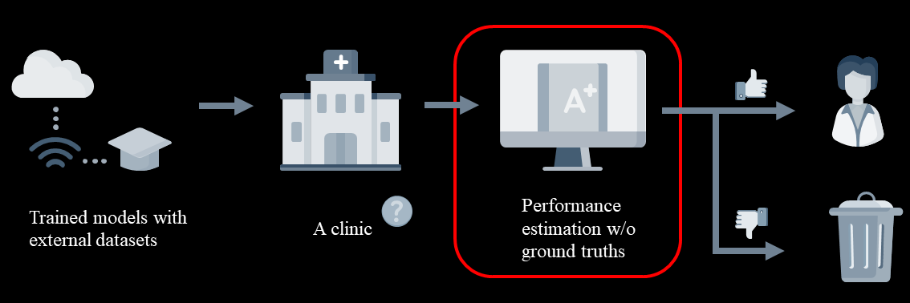

## Requirements

```
pytorch==1.2.0
scipy==1.2.1
nibabel==2.4.1
pandas==1.0.1
numpy==1.16.2
```

## Introduction

It is difficult for the practitioner to assess the model reliability on the target domain as labeled data for a new test domain is usually not available. It would be of great practical value to develop a tool to estimate the performance of a trained model on an unseen test domain without access to ground truth.

In this study we aim to estimate the model performance by only making use of unlabeled test data from the target domain.

<br/> <div align=center></div>

We find existing methods struggle with data that present class imbalance, because the methods used to calibrate confidence do not account for bias induced by class imbalance, consequently failing to estimate class-wise accuracy. Here, we introduce class-wise calibration within the framework of performance estimation for imbalanced datasets.

<br/> <div align=center></div>

## Model Evaluation on Classification task

Refer to juypter notebook:
```
ImbalanceCIFAR10.ipynb
```

## Model Evaluation on Segmentation task

Refer to jupyter notebook:
```
Prostate.ipynb
```

## Citation
If you find our work has positively influenced your projects, please kindly consider to cite our work:

```
@article{li2022estimating,
  title={Estimating Model Performance under Domain Shifts with Class-Specific Confidence Scores},
  author={Li, Zeju and Kamnitsas, Konstantinos and Islam, Mobarakol and Chen, Chen and Glocker, Ben},
  journal={arXiv preprint arXiv:2207.09957},
  year={2022}
}
```